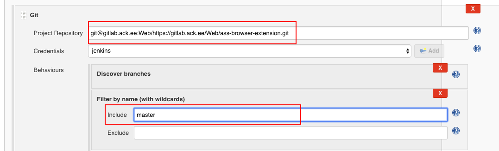

# Build project using Jenkins

This recipe describes how to setup Jenkins to automatically build project and deploy it to GS bucket. 
It consists of few steps made in Jenkins, Gitlab & repostory.

## Přidání Jenkinsfile do projektu
TBD - kde vzít Jenkinsfile?

* Změnit `projectName`
* PipelineReact - název funkce v groovy skriptu, která obsluhuje pipelinu
* `slackChannel` - Nastavit název slack kanálu pro konkrétní projekt, např. #ci-petshare
* Přidat větve pro buildění i jejich adresy pro deploy

## Create new job

1. Open https://jenkinsaurora.ack.ee/ in your browser.

2. Press **Nové** button in top left corner.  
 

3. Fill then first input field with your project name.

4. Now there are two options to create job
   * Create multipipeline branch from the scratch by clicking **Multibranch pipeline**.  
     

   * Recommended way is to create it by cloning existing job and changing few settings (you can use eg. `abibuch/abibuch-editor-frontend` job). Just scroll to the bottom of page and fill the "Copy from" field with name of job you want to clone. 
    

5. After confirm and getting to job configuration page, change the field **Project repository**. Then setup branches which will be scanned for changes by writing their names (separated by single space) into **Behaviours -> Discover branches -> Include** field, eg. `master development stage`.
 

6. Decide if `master` branch should been build automatically or only by manual triggering, it's __Supress automatic SCM triggering__ option.  
   

## Setup weboohok

Build webhook URL by replacing **GROUP_NAME/REPOSITORY_NAME** with your project's Gitlab group and repository name in followring URL pattern:  

`http://jenkinsaurora.ack.ee/git/notifyCommit?url=git@gitlab.ack.ee:GROUP_NAME/REPOSITORY_NAME.git`  

For example, if you have `https://gitlab.com/Web/awesome-project`, then the wehook URL is `http://jenkinsaurora.ack.ee/git/notifyCommit?url=git@gitlab.ack.ee:Web/awesome-project.git`.

In gitlab repository go to **Settings -> Integration** page and field the URL field with hook adress from previous step, then click Add webhook and check **Enable SSL verification** option is checked.
   

